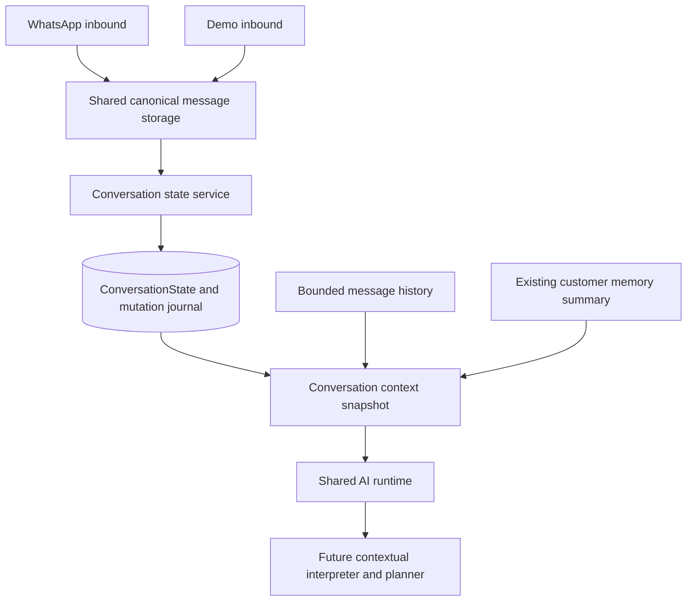

# Conversation System Sprint 1: state and context

## Architecture inspected before implementation

Conversation already owns business/lead scope, channel, inbox status, takeover flags and message relations, but no structured conversational workflow state. Message is canonical history, with transport correlation and metadata; it is not the right place for a mutable workflow document.

Reusable boundaries:

- `inbound-message-store.service.ts` is shared by WhatsApp, application inbound messages and demo storage; its transaction is the seam for message-associated state commands.
- `ai-message-store.service.ts` is shared by production and demo AI replies, including conversation preview/status updates and activity persistence.
- `ai-reply-runtime.service.ts` calls the shared formatter, provider and decision parser. A fresh conversation snapshot can be injected here after cached business context is loaded.
- `loadAiConversationHistory` already bounds history by triggering message and includes customer, AI and staff messages. It can be shared with the new snapshot provider.
- `ai-reply-engine.service.ts` owns booking execution, human review and production accounting; the appointment decision parser already exposes structured appointment intent. These are consumers for later state commands, not replacements for this foundation.
- Customer memory is a separate lead-level profile/item/extraction system with its own revisions. Follow-up jobs retain their own pending contexts and dedupe keys; customer issues use case/message relations and fingerprints. None is a substitute for current conversation state.
- Existing demo actors, persisted session checks and cascading business/conversation cleanup supply demo isolation and expiry. The same state table can safely serve demo and production when scoped through the same service.
- Existing services use Prisma transactions and explicit dedupe keys. The new state layer will use bounded Zod commands, optimistic revisions, and a durable command journal. No AI/network work belongs inside these transactions.



## Persistence and boundaries

`ConversationState` is a lazily created one-to-one conversation record. Its composite foreign key `(conversationId, businessId)` references the matching conversation, so even a direct insert cannot associate another business with that conversation. `ConversationStateEffect` uses the same composite ownership constraint. Both cascade with conversation deletion, including demo destruction. Migration: `20260910120000_conversation_state_context`. Historical conversations need no backfill.

Message rows remain the historical transcript. Customer memory remains the existing lead-level durable profile and extraction system. State is temporary workflow context; its entities do not automatically become customer memory. There is no new chatbot, appointment engine, extraction system or model-controlled state document.

## State and lifecycle

- `activeTopic` is a validated domain enum; `activeWorkflow` is a bounded identifier such as `APPOINTMENT_BOOKING`, independent of topic. `previousTopic` preserves the topic on explicit workflow changes/reset.
- Status supports IDLE, ACTIVE, WAITING_FOR_CUSTOMER, WAITING_FOR_SYSTEM, COMPLETED, CANCELLED and PAUSED.
- `awaiting` represents FIELD, CONFIRMATION, OPTION_SELECTION, FREE_TEXT or SYSTEM_RESULT. FIELD requires a field name. It can retain the exact question and a timestamp; `setAwaiting` also updates `lastAssistantQuestion` and the waiting status.
- `knownEntities` contains at most 32 named entities, each with a bounded scalar value, kind, optional confidence/provenance and timestamp. TIME requires normalized `HH:mm`; DATE requires an actual `YYYY-MM-DD` date; NUMBER/BOOLEAN require correctly typed normalized values. The service validates normalization, but does not extract it from natural language.
- `offeredOptions` contains at most 12 choices with unique IDs and positions, bounded labels and scalar values. Position preserves the meaning of an ordinal for Sprint 2.
- Each state document is limited to 24KB. Strict Zod schemas reject unknown patch fields and malformed values. No method accepts IDs/revision inside a canonical-state patch.
- Completion clears workflow, expectation, options and last question while retaining known entities. Pause retains state. Reset clears workflow, entities and expectations and retains the previous topic. Neither operation deletes history. Finished workflows cannot retain transient choices or expectations.
- `lastActivityAt`, `updatedAt` and revision expose activity/staleness. There is no automatic production expiry policy yet. Staff replies advance activity but takeover/resume never implicitly reset the workflow.

## Mutation API, transactions and concurrency

All operations require `{ businessId, conversationId }`; demo callers additionally require `demoSessionId`. The service validates conversation and business deletion status, channel, exact demo association, session status and expiry on every operation. No public route exposes an arbitrary state patch. Callers must continue to authorize staff/workflow permissions before invoking the internal service.

Methods: `get`, `initialize`, `patch`, `setEntity`, `setAwaiting`, `clearAwaiting`, `setActiveWorkflow`, `setOptions`, `clearOptions`, `completeWorkflow`, `pauseWorkflow`, `resetWorkflow`. Cancellation is an explicit patch using CANCELLED with all transient fields cleared.

Semantic writes require `expectedRevision`, `source`, and at least one of `sourceMessageId`/`sourceEffectId`. Sources are CUSTOMER_MESSAGE, AI_INTERPRETATION, WORKFLOW, STAFF, SYSTEM or DEMO. Source messages and entity provenance are checked against the same conversation/business. Calls can accept an existing `Prisma.TransactionClient`; otherwise the service owns a short transaction.

The mutation transaction locks the state row, checks the durable effect journal, then updates with `WHERE revision = expectedRevision` and increments the revision. A stale writer receives `409 CONVERSATION_STATE_CONFLICT`; the caller must reload and reconsider the command. The service does not blindly retry semantic changes. This prevents an older AI operation from silently replacing newer fields.

`sourceEffectId` is the preferred durable idempotency key. Without it the key is message ID plus operation (and entity key for entity commands). Replays of the same validated command return the current state without incrementing revision; a different payload for the same key returns `CONVERSATION_STATE_IDEMPOTENCY_CONFLICT`. The journal retains a SHA-256 canonical command hash, source, changed field names and before/after revision; it does not retain message bodies. Distinct effects from one message require distinct effect IDs. Journal retention currently follows conversation retention.

Canonical inbound and AI storage call `recordMessage` inside the message transaction. Staff text storage does likewise. This records an idempotent activity effect, initializes state if needed and advances revision without inferring entities or pending questions. The internal activity-only operation merges under the row lock; it cannot overwrite semantic fields.

For deterministic message-associated changes, pass `stateChange: { expectedRevision, patch }` to `storeInboundCustomerMessage` or the options argument of `storeAiReply`. The message, preview/activity and state journal commit together; an invalid/stale patch rolls all of them back. In demo storage also pass the authenticated `demoSessionId`. Never perform provider/network calls inside this transaction.

Standalone committed mutations emit `conversation_state.updated` with scope, revisions, changed field names and source. Caller-owned transactions use the durable journal as their commit-aware audit, avoiding success logs for rolled-back writes. Tokens, entity values and message bodies are not logged by this layer.

## Context snapshot and shared runtime

```ts
const snapshot = await conversationContextService.getSnapshot({
  businessId, conversationId, messageId,
  // demoSessionId required for demo scope
  // customerMemorySummary comes from the existing production memory resolver
});
// { state, currentMessage, recentMessages, customerMemorySummary }
```

The snapshot uses a short repeatable-read transaction, lazy state initialization and a business-scoped trigger lookup. It returns chronological CUSTOMER/AI/STAFF history up to that trigger, ordered deterministically by timestamp and ID. `AI_MAX_CONTEXT_MESSAGES` configures the default window (12, maximum 50); direct consumers may request a bounded `maxMessages`. Recent bodies are capped at 2,000 characters, current text at 8,000 and the memory summary at 4,000. Demo snapshots always omit customer memory. Concurrent first-use serialization failures may retry the whole snapshot at most twice.

`generateContextReply` loads this snapshot immediately before the shared provider call, after any cached business context has been resolved. The prompt receives current state in an explicitly untrusted data section, with current message, recent history and existing memory in their existing sections; history and memory are not duplicated inside the serialized state section. It returns `conversationStateRevision` and `conversationSourceMessageId` alongside the provider result for a later guarded state command. Snapshot history is bounded independently of total historical message count. The existing formatter retains its business-context reduction rules; its token setting is a soft budget, not an exact tokenizer limit.

Conversational precedence is current message > state > recent history > customer memory > business knowledge. This governs interpretation of customer preferences and references; it never overrides confirmed business pricing/policies, system instructions, safety or backend action authorization. For example, East Legon in the current message outranks remembered Tema, but cannot invent an available branch.

Production WhatsApp/application inbound and demo inbound already use the canonical storage core. Production and demo AI both use `generateContextReply` and canonical AI persistence. Production booking, complaints, follow-ups, billing, WhatsApp delivery and memory policies remain in their existing modules. Demo keeps its existing reply-only policy, session validation and provider-boundary outbound guard. This state layer creates none of those production effects.

## Sprint 2 handoff and limits

1. Read `snapshot.currentMessage` plus `snapshot.state.awaiting`, `knownEntities`, `offeredOptions`, workflow and `lastAssistantQuestion` in a contextual interpreter.
2. Resolve dates, ordinal references and topic switches there; this sprint deliberately does not interpret “tomorrow” or “the second one.”
3. Validate extracted values with `entitySchema` and emit explicit commands through `conversationStateService`. Retain the snapshot revision; on conflict reload and recompute rather than resubmitting an old answer with a newer revision.
4. Let the existing appointment/complaint/follow-up modules report deterministic results with durable effect IDs. Persist reply-associated expectations via the shared store's `stateChange` option.
5. Define planner policy for stale/paused state and retention. Customer memory promotion remains an explicitly separate production process.

The tooth-pain regression fixture supplies reason, normalized noon and pending date through explicit commands. The options fixture supplies both choices and OPTION_SELECTION for “The second one.” These tests guarantee context availability, not natural-language extraction or final response quality. Existing system/automation messages are not automatically interpreted into workflow state. There is no new public staff reset endpoint; the internal reset/cancel API is ready for an authorized staff action layer.

## Verification

`test:conversation-state` runs the lifecycle/transaction/context tests and the opt-in Postgres suite. Existing demo regression fixtures mock the state boundary; the new suite executes real state/context/store services against a transactional in-memory database double. A provider-path regression verifies that pending options and workflow appear in the actual shared prompt.

To run the Postgres constraint/concurrency/cascade test, provision and migrate a dedicated database, set `NODE_ENV=test`, set both `DATABASE_URL` and `CONVERSATION_STATE_TEST_DATABASE_URL` to that database, and set `RUN_CONVERSATION_STATE_DATABASE_TESTS=true`. It is intentionally not run against the configured application database. The test checks actual composite foreign keys, concurrent writers, durable replay, demo A versus demo B/production access and cleanup isolation.

The repository has no generic `lint` or `test` scripts. Use `pnpm typecheck`, `pnpm typecheck:tests`, `pnpm test:conversation-state`, `pnpm test:demo` and `pnpm build` (or the equivalent installed `npx tsc`/`tsx` commands).

Implementation verification on 2026-09-10:

- `npx.cmd prisma generate`: passed. `prisma migrate status` showed only this migration pending; `npx.cmd prisma migrate deploy` applied it successfully to the configured database.
- `npx.cmd tsc --noEmit`, `npx.cmd tsc --project tests/tsconfig.json`, and `npx.cmd tsc`: passed.
- Combined state and complete demo suite: 80 passed, 7 database tests skipped.
- Final focused state/demo AI/message plus production knowledge-context/governance regressions: 63 passed, 1 database test skipped.
- After adding the production runtime freshness regression, final state suite: 8 passed, 1 database test skipped.
- No dedicated test database was available; the new real Postgres concurrency/FK suite was added but not executed. In-memory transaction tests do not prove database lock scheduling.

## Changed files

New files:

- `src/services/conversation-state.schema.ts`: bounded schemas and defaults.
- `src/services/conversation-state.service.ts`: scope checks, centralized commands, revisions, effects and transactional message hook.
- `src/services/conversation-context.service.ts`: consistent bounded snapshot.
- `prisma/migrations/20260910120000_conversation_state_context/migration.sql`: additive tables, constraints and indexes.
- `tests/conversation-state.test.ts` and `tests/conversation-state.integration.test.ts`: lifecycle, context, runtime, transaction, isolation and guarded database coverage.
- `docs/conversation-system-sprint-1.md`: architecture, API and handoff.

Updated files:

- `prisma/schema.prisma`: conversation relations and the two models.
- `src/services/ai-context-builder.service.ts` and `src/services/ai-reply-runtime.service.ts`: context type, precedence, formatter and fresh shared runtime snapshot.
- `src/services/inbound-message-store.service.ts`, `src/services/ai-message-store.service.ts`, `src/services/message.service.ts`: transactional inbound/AI/staff activity and optional semantic patches.
- `src/services/demo-message.service.ts`, `src/services/demo-ai-processing.service.ts`, `src/services/demo-business-context.provider.ts`: explicit authenticated demo scope through shared services.
- `tests/demo-ai.test.ts`, `tests/demo-message.test.ts`: boundary fixtures and shared provider context regression.
- `package.json`: `test:conversation-state` script.
