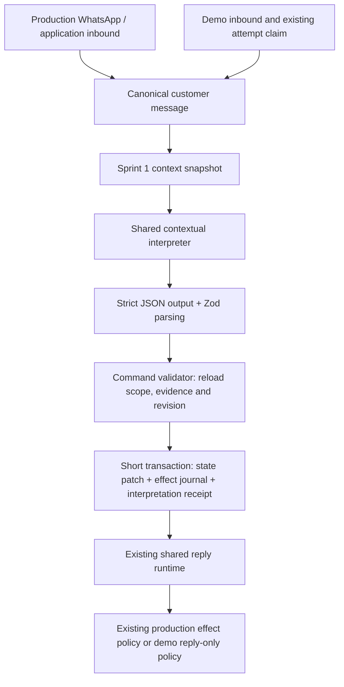

# Conversation System Sprint 2 — Contextual Understanding

## Inspection and reuse

Sprint 1 supplies tenant/demo validation, lazy state initialization, revision-checked patches, an effect journal and atomic message/state storage. Its shared `generateContextReply` already loads a fresh snapshot after cached business knowledge. The existing provider exposes `generateCompletion` for separate structured interpretation and `generateReply` for customer-facing responses. The existing reply parser supplies the canonical intent vocabulary, appointment fields and complaint structure; these remain the downstream contracts.

Production runtime owns subscription accounting, safety checks, booking/complaint execution, WhatsApp and other effects. Demo has a durable per-message attempt claim, a 50-turn bound, a shared time budget and reply-only safety. Customer memory remains a separate resolver/extraction system. No interpreter code will invoke those workflow effects or promote state to memory.

Existing confidence conventions are `AI_MIN_CONFIDENCE` (default .75) and `AI_AUTO_CONFIRM_MIN_CONFIDENCE` (default .85). Semantic interpretation and state mutations use AI_MIN_CONFIDENCE. The auto-confirm threshold belongs only to consequential appointment authorization, alongside its existing permissions and operational safeguards.

Sprint 1 stores options but has no option-issued timestamp; activity updates alone cannot establish freshness. Add an issuance timestamp maintained only by explicit option changes. Add a scoped interpretation receipt so replay after later state changes returns the original interpretation without another semantic update.

## Architecture

`conversationInterpreterService.interpret({ businessContext, conversationSnapshot, signal?, model? })` uses one separate completion for meaning. It does not write a customer reply, invoke appointment/complaint/follow-up services, send WhatsApp or promote customer memory. The validated executor owns persistence. `generateContextReply` runs this stage before the existing response generator and supplies the normalized interpretation and updated snapshot to it.

## Interpretation contract and context

`conversation-interpretation.schema.ts` defines the canonical semantic contract using the existing `AI_REPLY_INTENTS` vocabulary. Required fields are intent, bounded resolvedEntities, overall confidence and needsClarification. Optional fields represent topic/workflow action, pending-expectation resolution, selected option, confirmation, correction, topic shift and a bounded clarification code. Each entity includes type, value, normalized scalar where required, confidence, certainty, provenance and exact message evidence. Reference targets are EXPECTATION, ENTITY, OPTION or HISTORY. The provider transport schema requires explicit nulls for unused optional fields; parsing normalizes nulls to absence while rejecting unknown keys and malformed values.

The interpreter receives current message, workflow/topic/status, pending question, known entities, options, last question/intent, bounded recent history and the existing memory summary. Business metadata is restricted to name, timezone and at most 12 service names. It receives no Knowledge Hub dump. Customer memory is always omitted for demo. A continuation-intent candidate is a deterministic mapping of the existing workflow name to the existing intent enum; it is context, not a phrase classifier, and interruptions may override it.

All conversational content is untrusted data. Prompts distinguish interpreting that data from obeying instructions embedded in it. The model cannot submit Prisma data, tenant selectors, arbitrary state commands or a replacement state document. The backend constructs commands only after validation.

## Provider contract

The interpreter requests `response_format: json_schema` with `strict: true` and routes only to endpoints supporting the requested parameters. This follows the [OpenRouter structured output contract](https://openrouter.ai/docs/guides/features/structured-outputs). Strict JSON improves shape consistency; Zod and semantic validation remain mandatory because schema conformance is not proof of correct meaning. There is no silent downgrade to unrestricted JSON if an endpoint does not support the contract.

Interpretation is capped at one provider attempt and 2,400 output tokens. Demo passes its existing shared 30-second signal through interpretation and reply generation. Its durable attempt claim still bounds it to 50 attempted turns; a successful turn can now make two provider calls, one for meaning and one for a reply. Production successful-request accounting includes both calls' token and request totals; measured interpreter usage is also attached to failures for the existing production accounting path. Demo never invokes that accounting path.

## Dates, times and corrections

The snapshot reads timezone from the scoped business record, including demo businesses. Relative dates anchor to the canonical customer message's timestamp in that timezone, not server time, retry time or UTC. `Intl.DateTimeFormat` supplies the local date, weekday and clock. The model proposes a normalized date plus a calendar-day offset; backend calendar arithmetic verifies that the proposed date matches the local anchor and offset. EXPLICIT requires the normalized ISO date to appear verbatim in the evidence. Missing/invalid timezone or inconsistent date basis requires clarification.

Date strings must be actual calendar dates; exact times must be `HH:mm`. APPROXIMATE and AMBIGUOUS values cannot become canonical exact times. A normalized scalar labelled TEXT can be promoted only through the known field's DATE/TIME/NUMBER/BOOLEAN validator; no missing time or AM/PM is invented. The model understands the wording and computes the semantic offset. Backend validation verifies type, calendar validity, provenance and consistency; it cannot mathematically prove that a model understood every possible date expression correctly.

Corrections require an existing target key and a supported current-message replacement. The patch replaces that key's active value and preserves other entities. Old meaning and provenance remain in the interpretation receipts and state effect journal. Context/memory-derived entities cannot overwrite a contradictory current state value. There are no keyword handlers for named dates, ordinal phrases, confirmations or locations.

## Options and pending expectations

`offeredOptionsCreatedAt` is maintained by the state service only when options are explicitly supplied/cleared. A customer/staff/AI activity touch does not refresh it. Existing options without an issuance timestamp are treated as stale. `CONVERSATION_OPTIONS_TTL_MINUTES` defaults to 30 and is configurable from 1 to 1,440 minutes.

Option interpretation includes a candidate set and a reference basis: POSITION, EXACT_VALUE, ORDER, CONTEXT_FOCUS or AMBIGUOUS. The executor verifies actual scoped IDs, position/value consistency, freshness and `awaiting.field`. A structured position or exact value may narrow the candidates deterministically. CONTEXT_FOCUS requires a prior assistant/staff message that singles out exactly one current option; a missing or multi-option focus is rejected. AMBIGUOUS always produces clarification. Model confidence cannot override these checks.

The target entity must correspond to the pending field. The executor can map one exact proposed target value to a unique offered record, normalize that record's exact display label to its canonical value, and fill missing field metadata from the validated pending target. It does not assume all options represent appointment times. Unknown IDs, contradictory values, missing targets and non-unique candidates are rejected. Successful option resolution clears the expectation and temporary choices together.

FIELD resolution requires a validated entity for the actual pending field. CONFIRMATION accepts high-confidence YES/NO against an actual pending confirmation, without inventing a field name; it clears the pending question but grants no external authorization. SYSTEM_RESULT cannot be resolved by a customer, and FREE_TEXT completion is left to the planner. A topic interruption preserves the previous workflow and unanswered expectation. Local workflow cancellation requires canonical cancellation intent and clears only conversational workflow state.

## Confidence, commands, transactions and replay

The semantic threshold is `AI_MIN_CONFIDENCE`, normally .75. Overall and relevant entity/selection/confirmation confidences must meet it. Below-threshold results do not mutate semantic state and are retained for clarification; unknown/ambiguous results carry a reason code. Appointment auto-confirmation still separately requires `AI_AUTO_CONFIRM_MIN_CONFIDENCE`, normally .85. A high component score does not bypass a low overall score.

`conversationInterpretationCommandService.apply({ businessId, conversationId, demoSessionId?, sourceMessageId, snapshotRevision, interpretation })` parses the result, validates tenant/demo ownership and reloads the canonical CUSTOMER/INBOUND source and recent evidence. It locks the state row and checks the snapshot revision. The pure policy builds bounded SET_ENTITY, CLEAR_AWAITING, SET_WORKFLOW and SET_INTENT commands, then one validated Sprint 1 patch commits all changes atomically. A failed entity, receipt insert or revision check cannot leave a partially applied batch. No provider call occurs in this transaction.

`CONVERSATION_STATE_CONFLICT` causes the caller to stop. It must load a new snapshot and reinterpret; the executor never substitutes a newer revision into an old proposal. `ConversationInterpretation` has a unique `(businessId, conversationId, sourceMessageId)` receipt. It stores the validated result, snapshot revision and applied revision. An identical-message replay reads that receipt without calling the interpreter again or repeating its state transition, even if later messages changed the state. Ambiguity receipts likewise prevent repeated interpretation spend for the same message. A fresh clarification response is a new canonical message.

The additive migration `20260910140000_conversation_interpretation` adds that receipt table and the option timestamp. Composite conversation/business foreign keys enforce tenant ownership; conversation/demo destruction cascades receipts. The receipt is not permanent customer memory. Historical conversation state initializes lazily as before.

## Production and demo integration

There is one semantic intent contract. The response generator receives the validated interpretation, and the runtime normalizes its downstream decision to that intent. For unresolved ambiguity the compatibility intent is UNKNOWN and action-bearing appointment/complaint fields are removed. Successful booking date/time fields come from validated state when available. Existing human-review flags, safety checks, service/appointment validation and production permissions remain authoritative.

Production reply accounting records both provider requests while retaining the existing reply count and downstream effect policies. Demo uses the same interpreter/executor with its authenticated scope; it retains its separate attempt limit, reply-only prompt/safety, no-production-memory policy and provider-boundary WhatsApp guard. Provider/parser failures preserve canonical inbound history and commit no interpretation commands. A later reply-generation failure does not undo already validated customer meaning.

Structured events are `conversation_interpretation.completed`, `.ambiguous`, `.failed` and `.state_conflict`. They contain tenant/conversation/source IDs, snapshot revision, intent/confidence, resolved entity keys and command count. They do not log message bodies, evidence quotes, tokens or entity values. Raw diagnostic responses appear only in the explicitly opted-in live test using fictional data.

## Tests and Sprint 3 handoff

`pnpm test:conversation-interpreter` runs controlled-output tests through the real interpreter, parser, executor and state services against a transactional in-memory database double. Coverage includes the specified date/time/reference/confirmation/correction/interruption fixtures; invalid/ambiguous/stale options; timezone/DST boundaries; evidence validation; atomic rollback; receipt replay; revision conflicts; tenant/demo scope; provider failure; shared-runtime intent/usage behavior; and the exact requested dental multi-turn fixture. Normalization/candidate guards also cover failures observed during live testing.

`tests/conversation-interpreter.live.test.ts` is an opt-in five-case evaluation using the configured AI provider with database operations replaced by the same in-memory fixture. It evaluates relative date, ordinal selection, confirmation, correction and ambiguous selection. Run in PowerShell with `$env:RUN_CONVERSATION_INTERPRETER_LIVE_TESTS='true'` followed by `npx.cmd tsx --test tests/conversation-interpreter.live.test.ts`. It makes paid provider requests, but no application database changes. These are small evaluations, not a claim of universal language accuracy.

The dedicated Postgres state integration test now also checks concurrent interpretation receipts/replay and receipt cascade cleanup. It still requires the explicit dedicated-test-database environment guard described in Sprint 1 documentation; no concurrency tests run against the configured application database.

Sprint 3 should consume the runtime's normalized `interpretation`, `conversationStateRevision`, and snapshot. If clarification is required, plan a question instead of an action. Otherwise choose the next workflow/provider action using existing permissions. Persist the next assistant question and typed options with `storeAiReply(..., { stateChange: { expectedRevision, patch } })`, and set `awaiting.field` when options have a target. Decide staleness/resume policy without replacing the state service.

This sprint does not extract offered options or pending questions automatically from arbitrary assistant prose. Existing workflow code or the future planner must persist them through the Sprint 1 API; the multi-turn fixture explicitly supplies them at assistant turns. Reference resolution refuses options that exist only in prose but were never stored. No final response planner, topic-resume planner, RAG, new appointment engine, payment workflow or memory promotion is introduced.

## Implementation inventory and verification (2026-09-10)

Created: `conversation-interpreter.service.ts`, `conversation-interpretation.schema.ts`, `conversation-interpretation-output.ts`, `conversation-interpretation-policy.ts`, `conversation-interpretation-command.service.ts` under `src/services`; the additive Prisma migration; interpreter controlled/live tests; and `tests/helpers/conversation-state-fixture.ts`.

Updated: shared reply runtime, prompt context builder, existing intent vocabulary export, provider structured-output contract, production request accounting, state schema/service/context snapshot, Prisma schema, environment example/config, package scripts, state tests/integration test and demo AI test boundary.

| Verification | Actual result |
| --- | --- |
| `pnpm typecheck` | Passed |
| `pnpm typecheck:tests` | Passed |
| `pnpm test:conversation-state` | 8 passed, 1 dedicated-DB test skipped |
| `pnpm test:conversation-interpreter` | 38 passed |
| `pnpm test:demo` | 73 passed, 6 dedicated-DB tests skipped |
| `pnpm build` | Passed |
| Opt-in live interpreter evaluation, configured `openai/gpt-4o-mini` | Final run: 5 passed |
| `prisma generate` / `prisma migrate deploy` | Completed successfully; additive migration applied |

Earlier live iterations exposed invalid option-reference metadata and ambiguity errors that controlled fixtures did not reveal. The final schema separates prior-message focus from positional/value references, and backend validation rejects contradictory metadata. The final five-case run passed, but model interpretations remain probabilistic: structural/evidence validation cannot prove that every natural-language interpretation is correct. Broader model evaluation remains appropriate before enabling new consequential effects. No confidence threshold was lowered and no phrase dictionary was added.

The additional interpretation request increases per-turn latency and provider cost; both calls share the existing demo deadline. Providers must support strict structured output. A provider failure preserves inbound/state and follows existing failure handling rather than silently guessing.
