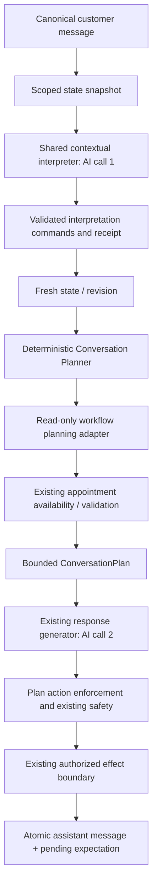

# Conversation System Sprint 3 — implementation notes

## Inspection and reuse (before implementation)

Sprint 1 owns scoped state, revision CAS, effect journals and atomic message/state persistence. Sprint 2 owns interpretation and immutable per-message receipts. The shared reply runtime is called by production and demo; the planner belongs there between interpretation and verbalization.

The production booking boundary already requires service/date/time, resolves the service from the business catalog, checks governance, and calls the existing appointment module. That module validates duration/location/assignee, rechecks availability inside its transaction, applies subscription and confirmation rules, and deduplicates via the existing booking log. Planning must expose these requirements, not duplicate availability or auto-confirmation logic. Missing service mapping is different from missing customer reason.

Existing complaint routing and human-review safety remain in the reply engine. Customer memory is separate from temporary conversation state; follow-up execution is outside this planner. Canonical inbound storage already records activity; `storeAiReply` already accepts a transactional state patch. Use it for assistant expectations. No additional AI call or mutable planner table is necessary.

## Architecture and ownership

The planner has no AI dependency and writes no semantic state. It inspects canonical interpretation and current state, invokes only read-only workflow inspection, and produces an ephemeral plan. The response generator receives the plan as the authoritative next move. Backend enforcement removes unsupported booking fields/actions and imposes the planned action while preserving stronger safety blocks. No additional model call, phrase dictionary, customer-memory promotion or parallel demo planner is introduced.

## Contract

`conversation-plan.schema.ts` defines a strict, bounded Zod contract: version, business/conversation/source scope, optional demo scope, move, canonical intent/topic/workflow, reason code, target/missing/known fields, selected option ID, response directives, confidence, human-review flag and state revision. Only supported appointment request kinds are permitted; there is no arbitrary payload or generic executable command. Typed options are limited to the existing 12-option schema. Plan data contains no generated customer prose.

Moves include ANSWER, ASK_FOR_FIELD, ASK_FOR_CONFIRMATION, ASK_FOR_OPTION, ASK_FOR_CLARIFICATION, CONTINUE_WORKFLOW, lifecycle/human/system-wait and NO_ACTION. Unsupported lifecycle/planner sophistication is not inferred from raw text. Labels and entity values remain untrusted data even inside an internally created plan.

## Precedence and requirements

1. Existing human/policy control stops automated replies.
2. Interpreter ambiguity produces clarification and no workflow request.
3. Explicit human requests and complaints follow existing review policy (demo only explains).
4. A current question/topic interruption is answered while preserving unresolved workflow context.
5. Explicit cancellation, pause and system-wait states are respected.
6. Rejected/pending confirmations and pending options are handled before new requirements.
7. An unresolved typed field is requested, unless service mapping requires adapter inspection.
8. The workflow adapter supplies ordered missing requirements, specific clarification, trusted options, confirmation or readiness.
9. Without an actionable workflow, answer normally.

The shared appointment minimum-input helper is used both by the adapter and the pre-existing booking boundary: date, time and a specific service mapping. The planner collects one missing requirement per turn, retaining known reason/time/date. It does not equate a customer's symptom/reason with a service ID. If the catalog mapping remains unresolved after date/time, SERVICE_MAPPING_REQUIRED requests a focused service clarification. Requirements carry priority, satisfaction, source and an optional group for future explicitly grouped collection.

## Adapter and appointment integration

`ConversationWorkflowPlanningAdapter.supports/inspect` returns structured requirements and NEEDS_INPUT, NEEDS_CLARIFICATION, READY_FOR_ACTION, OPTIONS, NEEDS_CONFIRMATION, WAITING or HUMAN_REQUIRED. Only booking is implemented; quotes/payments/follow-ups and a second complaint classifier are not introduced.

Production uses the existing catalog and read-only `checkSlot` before generating a response. A closed/unavailable slot yields specific clarification; operational governance or missing booking configuration requires review. Complete eligible input proposes CREATE_BOOKING_REQUEST to the existing engine. This is a request, not confirmation. Existing booking creation still owns subscription/actor/service/location/staff/governance checks, transaction-time availability recheck, idempotency, routing and actual confirmation. The planner never executes creation. Successful booking persistence clears the completed conversational workflow using a deterministic outcome patch.

Demo does not query production appointment availability or create bookings. Once temporal details are present it emits CHECK_APPOINTMENT_AVAILABILITY with DEMO_AVAILABILITY_NOT_CONNECTED, which is informational and never dispatched to production. The reply explains this limitation. Real provider options are supported by the adapter interface; the current availability module does not generate alternative slot lists, so this sprint does not invent them.

## Interruptions, corrections and cancellation

Pricing/general questions return ANSWER with suspendedContext and leave the existing awaiting field/workflow intact. Later continuation uses that state. Corrections and selected options are consumed from Sprint 2's already-updated entities; the planner does not reinterpret language or ask again for the replaced time.

A confidently interpreted cancellation with a topic shift is now allowed through Sprint 2's validated CANCEL command, provided the canonical intent is CANCELLATION_INTENT. This clears the local conversational workflow while the planner answers the new question. Mere interruption cannot cancel it. Neither cancellation nor a YES confirmation claims that an actual appointment was cancelled/confirmed.

## Assistant persistence, concurrency and replay

`storeAiReply` accepts an internal `plan`. Inside the message transaction it validates scope, locks the state row, looks for a previously committed AI reply for the same source, verifies revision/source ownership and creates the message with a plan-derived patch. FIELD, CONFIRMATION and OPTION_SELECTION questions record the final committed reply text, typed expectation and question together. Provider options get the existing server-generated issuance timestamp/TTL. Targeted clarification creates that typed pending field; an ambiguous reference preserves its existing unresolved expectation. WAIT_FOR_SYSTEM records SYSTEM_RESULT. Interruption answers do not clear pending context.

No pending question is stored during planning or provider generation. A state/effect journal failure rolls back the assistant message as well. A stale plan cannot substitute a newer revision. Scope/revision checks occur before and after adapter inspection, before production effect handling and under the state-row lock inside appointment creation. Message persistence repeats the check under its own lock. A concurrent inbound after a valid booking commit may make its reply stale; the existing booking idempotency prevents re-creation, while the stale reply is rejected rather than overwriting newer context.

No new Prisma table/migration is needed. The bounded plan is an immutable snapshot in the canonical assistant message metadata (`conversationPlan`), keyed by its sourceMessageId for replay. The production entry point and existing demo entry point return an already committed reply without another model call, effect or delivery attempt. Locked message persistence also returns that original reply for concurrent retries. Delivery retry remains the existing transport's responsibility. Before a reply commits, identical inputs derive the same plan; revision changes require re-interpretation/re-planning instead of silently using newer state.

## Safety and observability

Late human takeover or disabling AI also invalidates an automated plan without resetting its state. Scope is checked against actual conversation ownership and active demo expiry, not just supplied IDs. The source must be a canonical customer inbound message. Production memory, notifications, follow-ups and WhatsApp keep their existing boundaries; demo gains only scoped state changes. Human-review safety can still veto a plan. Adapter failures return clarification with no action. Plans and reply metadata never include bearer credentials.

Events: conversation_plan.created, clarification, workflow_ready, replayed, conflict and failed. Logs contain IDs, revision, intent/move, target and reason codes; no customer prose, entity values or option labels are logged.

## Tests and limitations

The dedicated planner suite uses real planner/state/message storage with a transactional in-memory DB double. It covers missing/known fields, strict schemas, safety precedence, ambiguity, confirmation, correction, option selection, interruptions/resumption/cancellation, tenant/demo scope, provider failure, in-flight conflicts, atomic rollback, same-source replay and two-call runtime integration. The exact dental sequence uses real Sprint 2 command validation and planner-generated assistant expectations; fictional provider options/confirmation come through the adapter boundary, not model prose. Separate appointment-boundary tests exercise existing availability/service validation with mocked database reads. Existing interpreter, state, demo and knowledge runtime/prompt regressions are also run.

Database integration suites remain guarded and are not run against the configured application database. Model wording adherence is guided by the authoritative prompt, while executable actions and state patches are deterministically constrained; this sprint does not semantically prove every generated sentence or implement a replacement natural-language engine. Alternative slot generation, richer rescheduling/cancellation execution, grouped questions and sophisticated topic resumption remain future adapter/planner work. No live paid model evaluation was added for this deterministic layer.

## Sprint 4 handoff

Consume `conversationPlan` plus the validated interpretation, current state and trusted backend result. Verbalize exactly its purpose/target/options, acknowledge existing facts, and ask one logical question. Keep actual outcomes separate from pending workflow requests. Improve response-shape/wording verification without another planner model call. Persist the final wording via `storeAiReply(..., {plan})`; do not write awaiting or options independently. For successful deterministic outcomes, pass a stateChange at the same plan revision. New workflow adapters should return typed requirements/results and leave execution/permissions in their owning module.

## Changed files and verification

New services: `conversation-plan.schema.ts`, `conversation-planner.service.ts`, `conversation-workflow-planning.service.ts`, and `appointment/appointment-conversation-requirements.ts`. Updated shared reply runtime/context, AI message store, production reply engine, demo processing, conversation scope reads, appointment creation/types and the explicit-cancellation interpretation guard. Added planner and appointment-boundary tests, updated reusable fixtures/demo tests and added the package script. No Prisma schema change or database migration.

Verification executed on 2026-09-11:

| Command | Result |
| --- | --- |
| `pnpm typecheck` | Passed |
| `pnpm typecheck:tests` | Passed |
| `pnpm test:conversation-state` | 8 passed; 1 dedicated-DB test skipped |
| `pnpm test:conversation-interpreter` | 38 passed |
| `pnpm test:conversation-planner` | 29 passed |
| `pnpm test:demo` | 73 passed; 6 dedicated-DB tests skipped |
| Appointment boundary + knowledge structured-context/runtime governance/guard-loading tests | 23 passed |
| `pnpm build` | Passed |

The transactional guards acquire conversation then state locks, matching canonical inbound persistence and serializing late staff-control updates. The new planner lock paths have not been exercised against a real concurrent PostgreSQL database in this run; the dedicated database tests were skipped. The reported planner transaction tests use an in-memory double.
