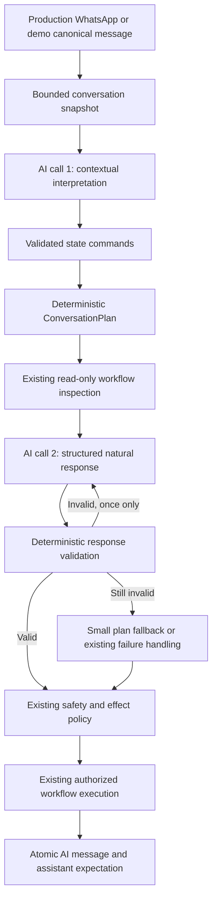

# Conversation System Sprint 4

## Inspection and reuse

Sprint 3 inserts a deterministic plan in the shared runtime, but the existing reply provider/parser still expects independent intent/action output. This sprint makes that second stage a structured verbalizer, retains the existing provider transport, and constructs compatibility decisions from the trusted plan. The state/message transaction, demo attempt budget, human-review/complaint handling and appointment execution remain the owning boundaries. No third pipeline stage or planner AI call is introduced.

## Architecture and ownership

`generateContextReply()` remains the common entry point. The planner chooses the move, workflow, target field, review policy and permitted request. `conversationResponseService.generate()` chooses wording only. The existing provider transport accepts a strict response JSON schema instead of parsing another intent/action decision. The compatibility `AiReplyDecision` is constructed from the plan; booking data continues to come from the validated workflow request.

Normal eligible turns use two AI calls: interpretation and response. A contract violation may use one corrective regeneration of the response stage, making three provider requests for that turn, not a third conversational stage. Each response attempt sets `maxAttempts: 1`, so provider-model fallback cannot multiply the retry budget. Provider failures do not trigger corrective regeneration. `NO_ACTION` makes no response call. Request/token usage includes invalid generations and failed attempts where the transport supplies usage. The existing demo deadline signal spans both response attempts.

## Structured contract and validation

`conversation-response.schema.ts` defines bounded Zod validation and the provider JSON schema. The response includes:

- `text` (nullable for `NO_ACTION`, otherwise 1–1000 characters), `acknowledgedContext` and `fulfilledPurpose`;
- `askedField`, `questionCount`, exact `referencedOptionIds` and `referencedFactIds`;
- typed `claims`, `claimsActionCompleted`, confidence and the planner's `requiresHumanReview` value;
- up to five bounded supplemental complaint records, only for canonical `COMPLAINT`. These retain the existing category/severity/matching interface without choosing an intent or authorizing routing. Matched IDs must belong to the supplied scoped issue context.

Unknown fields, including an independent action or intent, are rejected. Raw response JSON is capped at 16 KB before parsing. The response metadata and text are validated before being offered to the message store.

The policy checks required presence, purpose, exact planned field, logical-question metadata and reliable English text patterns. It rejects recognizable wrong-field requests, multiple questions, re-requesting a known field, unplanned questions on `ANSWER`, internal terminology, form-like language, repeated greetings and repeated acknowledged openings. Recognizable service menus are rejected during unrelated field collection. The prompt directs 1–3 short sentences, selective acknowledgement, no default emoji and use of the existing business tone setting.

Corrected active time is used as the allowed value for workflow replies; mentioning an old explicit time is rejected. Option moves must reference every supplied option and reproduce its exact label; foreign IDs, missing labels and invented explicit times are rejected. Clarification can restate current options but cannot use recognizable language that chooses for the customer. Persisted options always come from the plan, never from model text.

Prices require a cited fact from the governed context envelope. Currency and amount must match the cited evidence. The grounding list is limited to 30 facts, at most 800 characters each, drawn from bounded service, demo, policy and approved-knowledge sections. Blocked knowledge is redacted by the existing formatter before this list is built. Unknown prices stay unknown. Pricing interruptions receive `ANSWER`, with no automatically appended booking question or mutation of the pending workflow.

All conversation, memory and business content remains untrusted data. The supplied plan and backend result are structural inputs, not permissions embedded in customer text. Context precedence remains current message, current state, recent history, customer memory, then business knowledge.

## Workflow result grounding

`WorkflowExecutionResult` is separate from `ConversationPlan`. It contains business, conversation, source message and snapshot revision, one of `REQUESTED`, `SUCCEEDED`, `FAILED`, `NOT_EXECUTED`, and explicitly supported claim categories.

The appointment adapter reports the actual existing `checkSlot()` result through `PlanningInput.onWorkflowResult`. A successful available-slot check supports `AVAILABILITY` only; it does not support appointment confirmation. Failed availability results do not grant a success claim. Without an actual result, a production request is only `REQUESTED`. Demo checks remain `NOT_EXECUTED` because demo availability is not connected.

The validator requires matching scope/revision and `SUCCEEDED` before accepting a supported outcome claim. It also scans for common false-confirmation, availability, payment, refund, quote, assignment and handoff wording even when the model dishonestly leaves claim metadata empty. Demo completion claims are rejected regardless of supplied result metadata.

Actual appointment creation remains in the existing production engine after generation and safety checks. A saved pending appointment uses truthful deterministic wording: “Your appointment request has been saved for the business to review.” Existing confirmed-appointment wording is selected only from the actual confirmed record and existing auto-confirm policy. No extra AI call is made to verbalize that result. Its persisted response metadata has source `WORKFLOW_RESULT`; the actual result and appointment ID are stored alongside it. Existing human-review routing and all effect authorization remain in place.

## Retry, persistence and isolation

One invalid response can be regenerated using violation codes and the same trusted plan/context. Plan currency, tenant scope and conversation control are rechecked before attempts and after generation. Revision conflicts are returned for re-planning, never silently applied to a newer revision. After two invalid outputs, a small deterministic fallback exists for simple collection, clarification, confirmation, options or waiting. Fallbacks pass the same validator. Factual answers have no invented template fallback; they use existing failure handling.

The response stage does not write semantic state or perform external effects. A provider failure preserves the canonical inbound message and existing interpreted state. The existing demo durable claim prevents retries from spending again after a failed processing attempt.

`storeAiReply()` checks that persisted text matches the validated text. Its existing conversation/state locks, revision guard and source-message replay check remain authoritative. The message, plan-derived awaiting/question/options, audit effect and preview commit in one transaction. An audit failure rolls them back together. Replay returns the original message and metadata without another state revision. Delivery and demo realtime publication remain after commit.

`metadata.conversationResponse` records validation version, purpose, asked field, option IDs, completion flag, regeneration count, fallback use and source (`MODEL`, `PLAN_FALLBACK`, `WORKFLOW_RESULT`, `NO_ACTION`). No hidden reasoning is stored. Events `generated`, `validation_failed`, `regenerated`, `fallback_used` and `persisted` log identifiers and policy metadata, not message bodies or demo credentials. `persisted` is emitted by callers after transaction commit.

Production and demo use the same response abstraction. Business/conversation/source/revision checks reuse Sprint 1–3 boundaries. Demo scope is inherited through the existing demo-owned business/conversation, not a new state table. No production appointment, payment, memory, follow-up or WhatsApp effects are introduced for demo. Existing scoped demo realtime behavior is retained. BASIC, PLUS and PREMIUM all use the same state/interpreter/planner/response path; capabilities affect actions and limits, not wording policy.

## Files and database changes

New files:

- `src/services/conversation-response.schema.ts`
- `src/services/conversation-response-policy.service.ts`
- `src/services/conversation-response.service.ts`
- `tests/conversation-response.test.ts`
- `tests/helpers/response-output.ts`
- this document

Updated integration points: `ai-context-builder.service.ts`, `ai-provider.service.ts`, `ai-reply-runtime.service.ts`, `conversation-workflow-planning.service.ts`, `ai-safety.service.ts`, `ai-message-store.service.ts`, `ai-reply-engine.service.ts`, and `demo-ai-processing.service.ts`. Updated existing state/interpreter/planner/demo provider fixtures and added `test:conversation-response` in `package.json`.

No Prisma schema change, migration, new endpoint, new environment flag or dependency is required. The response layer is active through the existing shared runtime once this code is deployed. Existing deployment migration requirements from earlier sprints still apply.

## Verification — 2026-09-15

Commands actually executed successfully:

| Command | Result |
| --- | --- |
| `pnpm typecheck` | Passed |
| `pnpm typecheck:tests` | Passed |
| `pnpm test:conversation-state` | 8 passed, 1 skipped |
| `pnpm test:conversation-interpreter` | 38 passed |
| `pnpm test:conversation-planner` | 29 passed |
| `pnpm test:conversation-response` | 45 passed |
| `pnpm test:demo` | 73 passed, 6 skipped |
| `pnpm build` | Passed |
| `npx tsx --test tests/appointment-planner-boundary.test.ts tests/knowledge-structured-context-policy.test.ts` | 13 passed |

Total: 206 passing tests, 7 explicitly skipped database integration tests. No disposable integration database was configured; the application database was not used as a destructive test target. The repository has no general lint or test script; the named scripts above are its relevant equivalents.

The 45 response tests cover field/purpose adherence, deceptive metadata, logical questions, known values, corrected time, repeated greetings/acknowledgements, options, ambiguity, unsupported outcomes, result scope/revision, grounded prices, tier parity, demo isolation, malformed JSON, provider failure, bounded regeneration, safe fallback, source replay, text mismatch, transactional rollback and complaint references. The exact dental customer sequence runs validated interpretation commands, real planning, structured response validation and atomic persistence for all seven visible replies. It checks short wording, correction to 3 PM, no false confirmation and preserved booking context across pricing interruption. Controlled provider outputs test the response contract; this is not a claim that a live model always produces those exact sentences.

## Limitations and Sprint 5 handoff

Deterministic text checks are conservative English heuristics, not a proof of arbitrary natural-language truth. Structured claims and references are the primary contract. Paraphrases, service-to-price semantic mismatches, relative-date wording and nuanced tone still depend partly on model adherence. The original Sprint 4 verification did not run live model-quality evaluation; the follow-up results below cover six live response cases. Multilingual response policies and broader live quality evaluation need separate work.

Existing appointment execution and final message persistence are separate transactions; this sprint retains their existing idempotency/failure handling. It does not make all external effects and delivery globally atomic. Human-review behavior can still suppress an automated reply under existing production policy. The legacy prompt/parser remain available for compatibility, but shared conversational response generation no longer uses their independent intent/action output.

Sprint 5 should:

1. Extend the existing workflow adapters and result contract with typed outcome payloads and verified result producers for routing, cancellation and other supported effects. Never derive success from a requested plan move.
2. Add explicit interruption/resume policy in the deterministic planner. `ANSWER` currently preserves suspended workflow context; the response layer must not decide when to resume it.
3. Continue applying expected-revision state batches and source-message effect IDs. Persist the planner's exact next expectation/options with the validated reply.
4. Supply trusted result data through the shared runtime and preserve strict demo effect policy. Connect real demo-safe availability only if a later sprint intentionally provides it.
5. Reuse `conversationResponseService.generate()` and `conversationResponsePolicyService.validate()` for verbalization. Keep wording separate from permissions, actions and topic switching; do not add a planner AI call.

## Pre-Sprint 5 confidence correction

Semantic safety now receives `ConversationPlan.confidence`, inherited from contextual interpretation. `ConversationResponse.confidence` remains available in `validatedResponse` as wording-quality telemetry only: it cannot authorize effects, bypass planner restrictions, or block a semantically confident reply. Safe fallback confidence likewise cannot increase semantic confidence. `NO_ACTION` metadata now uses source `NO_ACTION`, with zero provider calls and `fallbackUsed: false`.

Two regression tests exercise the real response/runtime-to-safety boundary with an explicit 0.80 safety threshold:

- Plan confidence 0.96 and valid wording confidence 0.40: semantic confidence remains 0.96 and safety permits the reply.
- Ambiguous interpretation confidence 0.40 and wording confidence 1.0: the plan remains clarification, intent remains UNKNOWN, no workflow request/appointment payload is authorized, and semantic low-confidence safety remains effective.

Follow-up verification: `pnpm typecheck`, `pnpm typecheck:tests` and `pnpm build` passed; `pnpm test:conversation-response` passed 47 tests, `pnpm test:conversation-interpreter` passed 38, `pnpm test:conversation-planner` passed 29, and `pnpm test:demo` passed 73 with 6 database integration tests skipped.

### Live response smoke evaluation

Opt in with `RUN_CONVERSATION_RESPONSE_LIVE_TESTS=true` and run `npx tsx --test tests/conversation-response.live.test.ts`. This uses the configured paid provider with synthetic inputs, an in-memory database and no customer/production side effects. Each of six cases permits the existing single corrective retry; fallback counts as a quality failure rather than a generated-response success. These are response-stage smoke cases, not an end-to-end interpreter or PostgreSQL evaluation.

Run on 2026-09-15 with `openai/gpt-4o-mini`: **4 passed, 2 failed quality expectations**, eight response requests total.

| Case | Actual outcome |
| --- | --- |
| Pending date | Passed first attempt: “What day would you like to come in?” |
| Corrected time | Passed first attempt; asks for the date without reintroducing the old time |
| Options | Passed first attempt; presents 12 PM and 2 PM and asks which time |
| Clarification | Two invalid generations; safe fallback “Could you clarify what you mean?”; quality test failed |
| Confirmation | Passed first attempt: “Would you like to continue with the appointment at 2 PM?” |
| Unknown price | Two invalid generations; `CONVERSATION_RESPONSE_INVALID`, no generated reply; quality test failed |

The confidence wiring correction is independent of these quality findings. No validator rules were relaxed to make the live run green. Clarification and unknown-price model adherence need follow-up before claiming consistently natural live responses. Real PostgreSQL concurrency testing remains outstanding on a disposable database.
