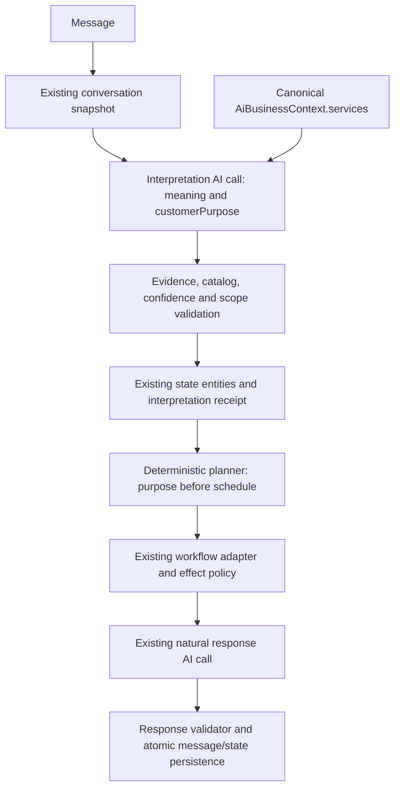

# Conversation Sprint 5A: customer goal and service resolution

The shared interpreter now proposes the customer's purpose before the planner collects booking details. A generic booking request asks what help is needed. A sufficiently evidenced description can resolve to an existing canonical service without requiring the customer to repeat its catalog name.

## Representation and persistence

There is no new table or Prisma migration. The existing bounded `knownEntities` stores:

| Entity | Meaning |
| --- | --- |
| `customerGoal` | ARRANGE_SERVICE, SEEK_SERVICE, INQUIRE_SERVICE, SUPPORT, COMPLAINT, HUMAN_ASSISTANCE or GENERAL_INQUIRY |
| `serviceNeed` | The customer's need, independent of the catalog's wording |
| `serviceResolution` | EXACT, INFERRED, AMBIGUOUS, UNRESOLVED, UNSUPPORTED or UNSPECIFIED |
| `serviceId` / `serviceName` | Only the validated canonical service selected from this context |

Entities retain source-message provenance, confidence and timestamps. The bounded interpretation receipt preserves the proposal, candidate IDs and evidence. New purpose writes clear obsolete service aliases in one state patch, so contradictory selected services do not accumulate. Legacy explicitly selected service IDs/names remain readable, but must still resolve uniquely in the current catalog. A free-text reason alone does not authorize a catalog mapping.

## Interpretation and validation

`customerPurpose` is an optional structured interpretation field for backward-compatible receipts. It contains goal, need, resolution, selected ID, at most three candidate IDs, mapping confidence, literal current-message evidence and literal catalog evidence. The interpreter uses runtime service names/descriptions for semantic matching; there is no industry router or phrase dictionary.

The deterministic policy verifies the scoped context, current-message evidence, unique catalog IDs, exact-reference evidence and inferred-mapping catalog evidence. Booking intent and an arranging goal must agree. Unsupported or unresolved results cannot carry a selected service ID. Ambiguous results require multiple real candidates. Low mapping confidence preserves the need but removes the selected service. General semantic low confidence continues to block semantic mutation under the existing policy.

Validation proves that references and evidence exist; it cannot mathematically prove the model's semantic inference from those facts. Poor or sparse service descriptions can therefore require clarification. The interpreter retains the existing bounded catalog window (up to 12 services, names capped at 180 characters and descriptions at 300); broader catalog retrieval is future work. No service records or business facts are invented.

Purpose-specific uncertainty is separate from uncertainty about the whole message: a clear goal with an ambiguous service can be persisted, together with independently validated supplied date/time values. Invalid command batches still apply nothing. Temporal normalization and confidence thresholds remain the existing interpreter policy.

## Planner and response behavior

For booking intent, purpose is checked before stale pending date/time questions and before the appointment adapter's temporal requirements. The adapter also independently checks purpose. No booking workflow starts from a generic purpose-free request. Supplied date/time values are retained, but the planner does not ask for additional scheduling details until a supported service is resolved.

An ambiguous seeking-service request produces one clarification, with at most three validated catalog candidates available to the response generator. A service inquiry does not automatically start booking. The response generator owns wording; the plan carries `targetField: serviceNeed` and bounded clarification context. The response validator rejects date/time collection under that plan. Existing regeneration and safe fallback behavior remain available for invalid model wording.

Human control and generic semantic ambiguity retain their protections. Existing established workflows are not automatically switched to another purpose; richer topic changes and resume are deferred. A generic continuation does not erase an already resolved purpose.

## Concurrency, isolation and effects

The existing message-scoped interpretation receipt provides replay idempotency. State mutation still uses the existing short transaction, revision comparison, state lock and effect audit. Evidence is reloaded from scoped persisted messages. The canonical context must match business, conversation, demo session and source message. There are no AI/network calls inside the state transaction.

Production and demo use identical purpose interpretation, validation and planning. Demo's canonical service IDs remain demo-scoped and temporary. Existing demo no-production-effects rules, production Knowledge Hub guards, appointment authorization and false-confirmation protections are unchanged. Basic, Plus and Premium share this reasoning path.

Normal conversational processing remains two AI calls: interpretation, then response generation. No resolver AI call was added. Existing corrective response regeneration can still make an additional attempt when validation rejects generated wording.

## Verification and limitations

`pnpm test:conversation-purpose` covers generic booking, described needs, ambiguous choices, exact references, complete requests, unsupported services and service inquiries across consultancy, repair, plumbing and photography fixtures in production Basic and demo. It also exercises purpose clarification across turns, supplied date/time retention, invalid evidence/catalog references, low mapping confidence, replay, revision conflict, scope rejection, provider failure, transaction rollback and independent adapter/response guards.

The suite uses controlled provider outputs and the existing in-memory database fixture. It verifies the shared contract and deterministic pipeline, not live-model language quality. Existing database integration suites require their configured PostgreSQL test environment.

Sprint 5B can consume `customerGoal`, `serviceNeed`, `serviceResolution` and the selected canonical service through the existing snapshot. It must explicitly handle workflow switching/resume and corrections while preserving receipts, revision checks and effect policy. This sprint adds no topic-drift auto-resume, advanced corrections, cancellation switching, quotations, payments or RAG.
