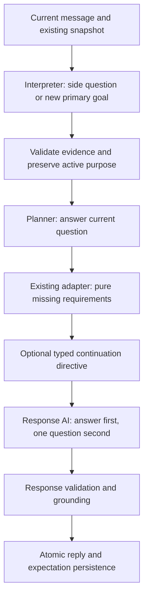

# Conversation Sprint 5B: workflow continuity

The existing shared conversation pipeline can answer a temporary business question and then ask one still-missing workflow field in the same reply. Customers can answer that question directly without saying “continue.” Demo and production use the same interpretation, state, planning and response code.

## Reused architecture

Sprint 5A's `customerGoal`, `serviceNeed`, `serviceResolution` and canonical service selection remain in existing conversation state. `activeWorkflow`, `workflowStatus`, `awaiting`, typed entities, interpretation receipts and state effects remain the source of truth. There is no new workflow store, migration, service catalog or conversational AI call.



## Topic drift and state preservation

The existing interpretation `topicShift` now optionally carries `kind: SIDE_QUESTION | NEW_PRIMARY_GOAL` and up to three literal current-message evidence quotes. The backend validates the message IDs, quotes, source topic and compatible informational intent. Old receipts without this field remain readable; they do not authorize automatic continuation.

When an unresolved purpose exists, informational turns and new-primary-goal proposals cannot replace its entities, service, pending question or workflow. Only the current `lastResolvedIntent` is recorded. Human requests and complaints also preserve the active purpose while retaining their existing safety intent. Proposed workflow transitions or entity writes on these turns are not applied. This prevents a service-detail question from changing the selected service or an hours question from becoming a chosen appointment time.

Language classification remains the interpreter's task. The policy uses structured intent categories and validated output; it contains no industry branches or customer-phrase router. A changed primary goal is preserved in the interpretation receipt for future handling, without switching workflows or forcing a return to the old goal.

## Planner contract

An eligible reply remains `move: ANSWER`, with `responseDirective.purpose: ANSWER_CUSTOMER`, `askOneQuestion: true` and:

```ts
continuation: {
  kind: "ASK_FOR_FIELD",
  workflow: "APPOINTMENT_BOOKING",
  field: "preferredDate" // or preferredTime
}
suspendedContext: {
  workflow: "APPOINTMENT_BOOKING",
  stillAwaiting: "preferredDate"
}
```

The schema requires matching workflow and suspended context, an actually missing target, and no workflow request or human-review requirement. The planner does not infer continuation in the response prompt. It authorizes it explicitly after a high-confidence, evidenced side-question classification.

The existing appointment adapter exposes a synchronous `continuationField` method. It reuses the canonical service resolver and existing `missingAiBookingFields` rules. It reads current entities rather than trusting a stale `awaiting` field, so a known date leads to a time question. It never invokes availability checks, creates requests, confirms bookings or performs network/AI work. Normal appointment inspection remains unchanged.

Continuation is blocked for absent workflows, missing/uncertain purpose, unclear or low-confidence meaning, missing drift evidence, new primary goals, greetings, human requests, complaints, human control, disabled capabilities, paused/completed/cancelled workflows, pending system results, confirmations or options, unavailable catalog services, relevant knowledge guards, insufficient production booking configuration, and workflows with no supported missing field. Unknown workflow adapters do not implicitly opt in.

## Natural response and validation

The response contract derives `askedField` and question count from the plan. With continuation, it requires non-empty `answerText` and `continuationQuestion`, and `text` must be exactly the answer followed by one space and the question. Without continuation these two fields must be null. This prevents a missing/reordered answer, an unauthorized follow-up, asking a known field or silently changing the target. Price grounding, demo outcome restrictions, internal-term filtering and one-question validation still apply.

The model generates natural wording from the current question, canonical business facts and plan. Business opening hours remain distinct from appointment availability. Existing corrective regeneration remains; the existing unknown-price fallback can also ask the authorized field without inventing a price. No answer is fabricated when a grounded answer cannot be generated.

These structural checks do not prove semantic completeness or live-model answer quality. The model still owns natural language understanding and wording within backend constraints.

## Persistence and safety

The existing reply transaction stores the plan and response metadata with the AI message, then updates the pending field and last assistant turn using `assistantPlanPatch`. As in existing question persistence, the saved question text is the complete validated assistant turn. Goal, service, known entities, workflow and topic are retained; the workflow is not restarted. No new long-term memory or external effects are introduced.

Existing source-message idempotency, interpretation receipts, revision comparisons, tenant/demo checks and human-control rechecks remain. Plan validation also rechecks that the persisted workflow is eligible and the field remains unknown. Failed message/state transactions roll back together. Logs contain plan move, reason and continuation field, not message bodies.

## Tests and Sprint 5C boundary

`pnpm test:conversation-continuity` exercises price, hours and location interruptions across consultancy, repair, clinic, photography and salon fixtures in production Basic and demo, including the next field answer without an explicit resume command. Additional tests cover known fields, no workflow, escalation, lifecycle/policy blocks, changed purpose, malformed evidence, scope, revision conflict, atomic rollback, replay and response validation. Providers and database storage use controlled fixtures; this is not a live-model evaluation or a PostgreSQL concurrency benchmark.

Continuity is intentionally limited to safe appointment field collection. Side-question turns preserve rather than apply mixed entity corrections. Sprint 5C must explicitly design workflow switching, richer primary-goal transitions and advanced corrections. This sprint adds none of those, and no cancellation redesign, quotations, payments or RAG.
