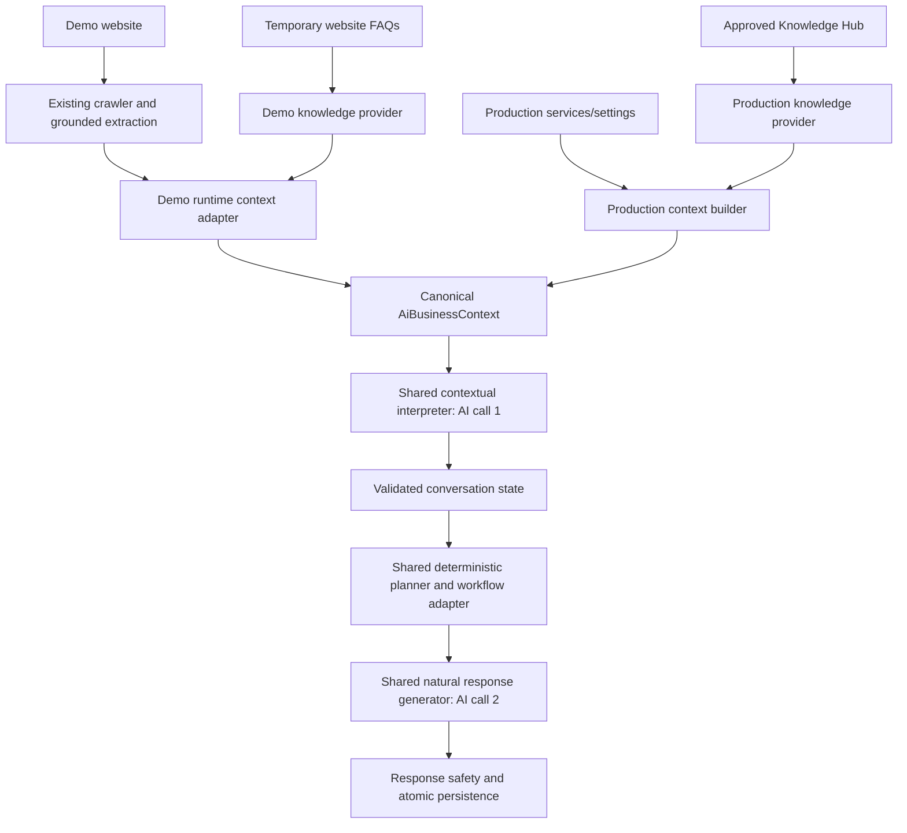

# Demo runtime context alignment

## Cause and architecture

The crawler already produced validated facts, but the demo adapter left the canonical service catalog, availability, policies and knowledge empty. The interpreter read `demoFacts.services`, the appointment adapter read `services`, and the response formatter carried a separate demo facts section. Capability flags were unconditional.

## Mapping

| Confirmed extraction | Canonical context | Unknowns / restrictions |
| --- | --- | --- |
| Services | `services` with deterministic IDs derived from business ID, demo session ID and service facts | No production Service rows; booking eligibility, permissions, staff, capacity and location rules remain absent |
| Service price and duration | `priceDescription`, `durationText`, source `WEBSITE` | No guessed currency, numeric price, price type or duration in minutes |
| Opening hours | `availability.summaryText`, source `WEBSITE`, meaning `BUSINESS_HOURS_NOT_SLOTS` | `weeklyHours: []`, `timezone: null`; no parsing of uncertain times, no live slot claim |
| Phone, email, address, locations, description and website | `business` | Only extracted values; locations are names, not appointment location permissions |
| Policies | `policies` with scoped reference IDs | Website prose remains untrusted data, never workflow instructions |
| FAQs | Up to six temporary `knowledgeDocumentChunks`, scoped document/chunk IDs | No Knowledge Hub writes, embeddings, production approvals or long-term memory |

The raw `demoFacts` property is retained as diagnostic source data for compatibility; it is not an alternate runtime catalog. Only its unknowns are added to the prompt. Interpreter service references, workflow matching, response facts and pricing grounding now consume the canonical fields. Website price text passes through the existing canonical price-redaction policy.

`RuntimeKnowledgeProvider<Scope>` exposes bounded deterministic retrieval. The production provider preserves the existing tenant, publication, client visibility, document approval, approved-fact, active-version and unresolved-review filters. The business context builder retains its knowledge revision/cache checks. The demo provider uses only an already validated, actor-scoped context and does no DB lookup. FAQ chunks remain untrusted website knowledge, not governance-approved facts. The formatter bounds each chunk to 1,240 characters so a validated FAQ question and answer fit; the existing overall context reduction remains in place.

## Capabilities and safety

Service, price and policy flags depend on available canonical data. Price capability includes confirmed service price text and recognized price evidence in knowledge chunks. `canAnswerBusinessHoursQuestions` is separate from `canAnswerAvailabilityQuestions`; the latter stays false in the demo. Canonical services allow booking-intent collection and service resolution, but the demo workflow adapter still cannot check slots or create a booking. It explains the disconnected capability after collecting details. Opening-hours answers must not carry the `AVAILABILITY` execution claim.

There are no industry-specific runtime rules, no crawler changes, no new AI call, no schema migration and no Sprint 5 functionality. The existing single corrective response regeneration may still run after an invalid model response; no retrieval/normalization model call was added. Tenant/demo scope, state revisions, interpretation receipts, transactional response persistence, provider send guards and production effect policies remain enforced.

## Timing

Both runtime callers emit `conversation_runtime.timing` with business/conversation/source-message IDs and `contextBuildMs`, `interpretationMs`, `plannerMs`, `workflowMs`, `responseMs`, `persistenceMs`, `totalMs`, including runtime failures. Context time includes snapshot reads. Planner time excludes its nested workflow adapter; production workflow execution is also measured. Persistence measures the atomic reply/state transaction. Total runs from context orchestration to completion, including other work in that interval, and need not equal the stage sum. Pre-context authorization/quota checks and idempotent reply replays are outside this measurement. Logs contain no customer text or credentials.

## Verification and limits

`pnpm test:demo-context` exercises the real adapter, interpreter validation, state, planner, response policy and persistence with controlled provider outputs: clinic hours, consultancy bookings, repair visit/date, salon known/unknown/FAQ prices, photography FAQs, noisy greeting and service listing. It verifies one interpreter plus one response call per successful normal turn, service resolution, no production data access/effects, scoped IDs, unknown operational settings and timing fields. A separate provider test asserts that production governance filters remain intact. These tests do not claim live-model language quality or real PostgreSQL concurrency coverage.

Run the normal typechecks, conversation suites, demo suite, build and affected appointment/knowledge regressions. Existing opt-in PostgreSQL tests still require their integration environment. Website hours remain textual and the business-local date anchor still comes from the existing conversation snapshot timezone; this change does not infer a timezone from website prose. No real appointments can be made in the demo.

### Changed files

New: `src/services/demo-runtime-context.adapter.ts`, `src/services/runtime-knowledge.provider.ts`, `src/services/conversation-runtime-timing.ts`, `tests/demo-runtime-context.test.ts`, `tests/runtime-knowledge-provider.test.ts`, and this document.

Updated: `src/services/ai-context-builder.service.ts`, `src/services/demo-business-context.provider.ts`, `src/services/conversation-interpreter.service.ts`, `src/services/conversation-response.service.ts`, `src/services/conversation-workflow-planning.service.ts`, `src/services/ai-reply-runtime.service.ts`, `src/services/ai-reply-engine.service.ts`, `src/services/demo-ai-processing.service.ts`, `src/services/knowledge-document/knowledge-structured-context-policy.ts`, `tests/demo-ai.test.ts`, `tests/knowledge-structured-context-policy.test.ts`, `package.json`, and `.gitignore` (exclude pnpm's local dependency cache).
